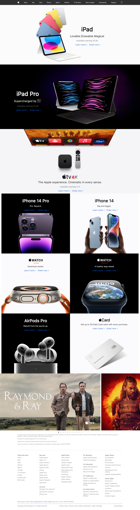

# Totality Corp Frontend Challenge

Website Attepted - [Apple.com](https://www.apple.com/)

## Live

[Click here](https://jjj4032002.github.io/totalitycorp-frontend-challenge/)

## Demo

## Tech Stack

HTML, CSS and React

## Approach

- My fundamental approach to code out this challenge was to divide the website into components. I divided it into five components - Navbar, Banners - (Ipad, Ipad Pro, Apple Tv), Gallery, Carousel and Footer.
- I followed the above approach while coding the individual components too.
- I applied a mobile-first approach while writing the CSS.

## Challenges

- I found the carousel given on the main website difficult to imitate so I coded my own version.
- Making Images look good on various screen sizes so it looks similar to the main website.
